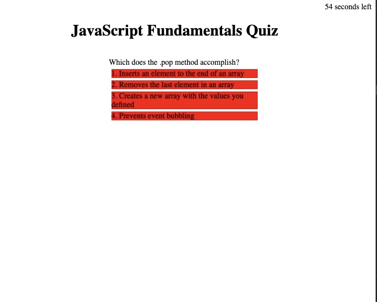

# Ever Muniz // Password Generator

## Description

I was not provided with any code for this project and had to create a page with HTML, CSS, and mainly JavaScript code. The purpose was to create a quiz on JavaScript fundamentals that was interactive, had a timer, and used local storage to retain high scores. I learned a lot about using local storage and how to retrieve that data. I also learned how to make a webpage more interactive and all the details that need to be watched. 

## Usage

- Click on "Begin Quiz" to begin your quiz
- A timer for 60 seconds will appear and begin counting down
- you must answer each question correctly or 10 seconds will be removed from the remaining time for every incorrect answer
- If the timer runs out you can try again
- If you answer all the questions then you will be showed your score and prompted to enter your username to save
- You can click on "View High Scores" to view all stored players and scores

[Click on this link to visit the deployed application](https://evermuniz.github.io/Ever-Muniz-JS-Fundamentals-Quiz/)

## Credits

- HTML, CSS, and JavaScript were written with no starter code
- References used to build the JavaScript code was provided by the U of U Coding Bootcamp and a few online searches

## License

Refer to license in repo
